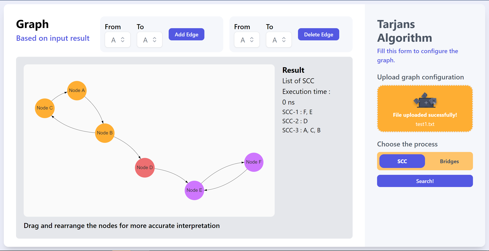
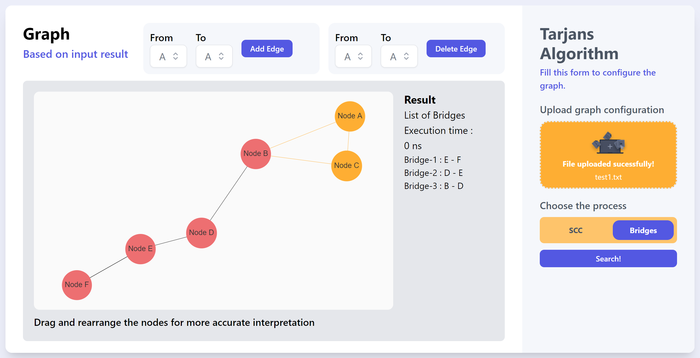

# 🕸 Tarjans Algorithm Simulation
> Frontend side of SCC and Bridges Finder using Tarjans Algorithm with React Typescript and Golang

## General Information
This program is created to find s Strongly Connected Component (SCC) on a directed Graph and Bridges on a undirected graph based on user input. The program will proceed a.txt file which containt directed adjacency lists to interpret a graph, then find the SCC and Bridges using popular SCC algorithm, Tarjans. User can also modify the graph by adding and deleting edges by filling the form. The program also provide a good graph and edge coloring to make a better undersanding about the results. Furthermore, the project information is also provided for future improvements.

## Project Structure
```bash
.
├─── img
├─── public
│   ├─── index.html
│   ├─── manifext.json
│   └─── robots.txt
├─── src
│   ├─── assets
│   │   └─── upload.png
│   ├─── components
│   │   ├─── Dropdown
│   │   │   └─── Dropdown.tsx
│   │   ├─── Forms
│   │   │   └─── Forms.tsx
│   │   └─── Graph
│   │       └─── GraphConfig.tsx
│   ├─── helper
│   │   └─── helper.tsx
│   ├─── App.css
│   ├─── App.tsx
│   ├─── index.css
│   ├─── index.tsx
│   ├─── react-app-env.d.ts
│   └─── react-graph-vis.d.ts
├─── test
│   ├─── test1.txt
│   ├─── test2.txt
│   ├─── test3.txt
│   ├─── test4.txt
│   └─── test5.txt
├─── .env.example
├─── .gitignore
├─── package-lock.json
├─── package.json
├─── postcss.config.js
├─── README.md
├─── tailwind.config.js
└─── tsconfig.js
```

## Prerequisites
- node.js (v 18.12.1)
- npm (v 8.19.2)
- React (v 18.2.0)
- Tailwind (v 3.3.2) for styling
- react-graph-vis (v 1.0.7) for graph illustrating
- react-toastify (v 9.1.3) for modals on error and success

## Algorithms
Algorithm implemented on backend side. Further explanation and implementation of Tarjans Algorithm stated on [this repository](https://github.com/mikeleo03/Tarjans-Algorithm-Simulation_Backend)

## How to Compile and Run the Program
Clone this repository from terminal with this command
``` bash
$ git clone https://github.com/mikeleo03/Tarjans-Algorithm-Simulation_Frontend.git
```
### Run the application on development server
Compile and download some required modules by running the following *command*
``` bash
$ npm install
$ npm start
```
If you do it correctly, the pogram should be running on localhost:3000. Don't forget to run the backend side also. Further explanation on how to run the backend development server stated on [this repository](https://github.com/mikeleo03/Tarjans-Algorithm-Simulation_Backend)

### Run the application from deployed website
You can also run the whole program by clicking this [deployment link](https://tarjans-simulation-frontend.vercel.app)

## How to Use the Program
1. Go to the website with the procedure explained before.
2. Insert a .txt file in the box provided on the form side to initiate a graph. The program also will give error messages if the input file is not well-formatted. If the input is valid, the graph of your input will be loaded in the left side with some additional buttons.
3. Explore the whole feature! You can add and delete edges and you can select the process then proceed to find the SCC or the bridges as you wanted to.
Get to know more about the website interface by looking at the screenshots down below.

## Available Scripts
In the project directory, you can run:

### `npm start`

Ths runs the app in the development mode.

The page will reload if you make edits.<br />
You will also see any lint errors in the console. You can also use the environment by appyling the basic .env configuration on .env.example file.

## Screenshots



## Contributors
<a href = "https://github.com/mikeleo03/markdown-editor/graphs/contributors">
  
</a>